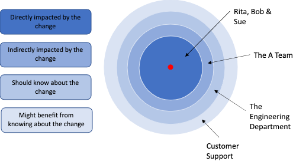

# Introduction

I'm sorry - were you looking for the article about how to drive change in 14 **easy** steps? If it's out there, it's a lie. Driving change is hard. And that's why so many people fail at it. Driving change *almost* to completion is fairly easy, but getting it over the line and, importantly, making it stick is an art, and, like many things, takes a lot of practice to get right.

Some changes are small and easy to make. This post isn't about those types of changes. This post is about substantial changes. Changes that have a significant impact on the people or the business such as a re-organisation or a transformation.

## First, a bit about different types of change

The four main types of change I've come across are transformational, people-centric, structural and cultural.

**Transformational** changes tend to involve large parts, if not the whole, of an organisation - for example, an agile transformation.

**People-centric** changes may be local or involve large parts or the whole of an organisation - for example, changes to roles and responsibilities or changes to policies.

**Structural** changes may also be local or involve large parts or the whole of an organisation - for example, hierarchical, line management or team membership changes.

**Cultural** changes may also be local or involve large parts or the whole of an organisation - for example, creating a culture of feedback or creating a culture of putting quality first. Cultural changes are perhaps the hardest to affect because they are difficult, if not impossible, to enforce; take longer to embed; and are often harder to measure.

In addition to these four types of change, there are also changes that you **need** to make and changes that you'd **like** to make. Changes that you **need** to make might be due to changes in regulations, the environment, the economy, or perhaps a decision has been made in another part of the business that you need to comply with. Even for changes that you **need** to make, you will often have some latitude around **how** you make that change.

## Secondly, a bit about different implementations of change

There are really only three ways to implement a change:

1. Big bang/all at once
2. A phased approach
3. Little by little/one step at a time

The type of implementation that is best suited to the type of change you want to make very much depends on the change and might not necessarily be obvious up front so it's important to consider all options.

## Next, some fundamental principles

### You need to understand the why

Regardless of whether the change is one you **need** to make or one you'd **like** to make, you've got to understand the reason for the change. What's the problem to be solved? In the case of a change you **need** to make, this will likely involve talking to the source of the change. If you don't fully understand the reason for the change then neither will your team(s), and when people don't understand the why for a change, they tend to find it hard to get on board.

### You need to understand the current state

Why are things the way they are? What's the history? What has been tried before? Was it successful? Why? Or why not?

### You need to know what the end state looks like

Or rather, the end state for what you are trying to achieve initially. If you can't articulate what the end state of a change looks like clearly, people will find it hard to come along with you on the journey - they don't know where they are going.

### You need to know what the benefits and risks of a change are

What problems are you hoping to solve by the change? What problems are **not** going to be solved by the change? Who is going to be impacted - negatively or positively - by the change? What are the worst and best case scenarios?

### Cutting corners will bite you in the behind

Cutting corners to accelerate a change, unless there is a specific and immediate business need to do so (such as a regulatory/compliance-related change), might lead to a faster change, but it will come back to haunt you. Changes that are rushed tend not to stick and the impact of cutting corners can be significant - such as attrition, loss of trust, loss of engagement etc. Don't be tempted to cut corners - you'll regret it.

### Giving up on the change renders all the previous efforts that went into the change useless

Successfully driving a change that sticks is hard work. It requires relentless persistence, effort and resilience. It's easy to give up on the change when at first it doesn't stick, particularly with a cultural change, but doing so renders everything that came before a waste. You will encounter obstacles when driving change, sometimes many. The only thing that sets apart people who are successful at driving change and people who are not is what you do when you encounter obstacles. Do you navigate/jump over/remove them? Or do you give up?

## Enough with the theory, let's move on to the practical implementation

Theory is OK, but it can be difficult to translate theory into practical implementation. To help you do that, here's how I implement big changes - step-by-step (having made many mistakes along the way and refined my approach).

#### Step 1 - Understand the why

As mentioned above, this step is crucial. Simply put, no change will be successful if you don't fully understand why you need or want to make the change. At this stage, I generally start formulating notes answering questions such as:

* What's the problem?
* Why do we need to make a change?
* What are the consequences of **not** making a change?
* What different perspectives are there?

#### Step 2 - Understand the current situation

To understand the current situation, I talk to a lot of people - mostly in a 1:1 setting. I want to know how things are today, why they are the way they are, and any historical context relating to the current situation. I add all information relating to the current situation to my notes.

#### Step 3 - Plant some early seeds

At this stage, I know there's a problem that needs to be solved and I know I either need or would like to implement a change that responds to that problem but I don't yet necessarily know what the potential solutions are or how any related changes might be received. Here's where I first start warming people up to the idea. How sensitive/confidential the change is determines who I talk to at this stage and the method in which I do this will also vary depending on the circumstances but regardless of the who and the how, this is the time when I start letting people know what I'm thinking about. I might start bringing up the topic in 1:1s; at a team meeting; in an email.

One method I use is via a weekly summary update email I send to the team. Every week, I communicate the things I'm working on right now, the things I'll be working on next and **the things I'm currently thinking about**. This accomplishes two things. First, it starts warming people up to the change. Secondly, it allows an opportunity for people to provide feedback on what that solution might look like and help me understand some risks that I might not have considered. I continue to plant the seeds throughout the process right up to the point when I'm ready to communicate the change.

#### Step 4 - Think about the end state

This is when I start thinking about potential solutions to the problem. What might an end state look like? What options are there? There is normally a lot of note-taking and analysing and picture drawing at this stage as I thrash out the various options and start thinking through all the different aspects involved in the change and the accompanying effects. Out of this, I will normally come up with 1-3 options for what an end state might look like.

#### Step 5 - Think about the benefits and risks

Now that I have a/some potential end states in mind, I start thinking in more detail about what the benefits and risks are of making the change. What problems will we solve if we achieve the intended outcome(s)? Are those problems still valid? What related problems **wouldn't** be solved by the change? (i.e. what's out of scope?) What are the trade offs? What risks do I already know about? Who do I need to talk to to get a better sense of the risks I don't already know about? I ask myself all of these questions and continue scribing and drawing.

#### Step 6 - Consider the implementation options

Then I start thinking about the implementation of the change. Do I think the change warrants a big bang approach or would it likely be more successful as a phased approach? What are the benefits and risks of each approach? Are there small changes that can be made now? Do I want to start small before rolling out wider? The type of change very much determines the options but it's important you consider all of them.

Unless there is a business need for an immediate change, I caution against pushing for a big bang approach purely because you want to create change faster. There are times when a big bang approach is still the best option, but don't do it because of impatience. Do it because the benefits and risks of making the change all at once outweigh the benefits and risks of implementing the change in smaller chunks.

#### Step 7 - Document the proposal for the change

You have considered the options, thought about the benefits and risks and now you're ready to document your proposal. The format for the proposal will depend largely on personal preference - I tend to use slides or a wiki to document a change proposal depending on how I'm thinking about sharing the proposal (i.e. if I'm going to present it, I'll use slides. If I'm going to email people for feedback, I'll use a wiki. Sometimes I'll do both). The things I include in the proposal are:

1. What's the problem I'm trying to solve and why do we need to make a change?
2. What's the current state/situation? (it's often useful to articulate this with words **and** with pictures - people tend to find it easier to process one or the other)
3. What does the end state look like? (again - words and pictures are beneficial) If there are options, what are they?
4. What problems does the end state solve? (and what problems does it not solve?)
4. What are the implementation options?
5. What are the benefits and risks of each option?
6. What is your preferred option? (this is important - it's your change, own it. You have more information about this change than anyone else so you are best placed having considered all the data to state what **you** think the best option is)
7. How are you going to measure the success of the change?
8. What do you need from others for the change to be successful?

#### Step 8 - Feedback from a small focus group

Now that you have a proposal for a change, it's time to get some more detailed feedback from a focus group. I'm not talking about a formal focus group workshop type session here (although there's nothing wrong with that approach).

Generally, I conduct this feedback stage 1:1 with a selection of people that includes some trusted peers; some peers who generally have a different perspective from me; and, depending on the sensitivity associated with the change, some people who will be directly affected by the change. Conducting these conversations 1:1 produces much higher quality feedback and elicits a much higher response rate than requesting feedback from a group. 

This stage is crucial. It allows me to:

1. Get a sense of how the change will be received
2. Identify blind spots
3. Gather different perspectives
4. Ensure people feel like they're part of the solution

The outcome of this step is normally a fair amount of proposal tweaking. 

What is important at this stage though is to set yourself a clear deadline for when this step will be complete. You can get lost going back and forth in a feedback/tweak loop forever and at some point you need to settle on a proposal, bite the bullet and get on with it. The following are important points to consider at this stage:

* Changes should be beneficial to most but are very unlikely to be beneficial to all. Don't get lost trying to please all of the people all of the time. You're invariably going to upset some folk but you have to consider the benefits and risks holistically.
* There is rarely a perfect solution and the only way to really know if a change will be successful is to do it. Don't delay searching for perfect when good enough will allow us to make the change and get some real feedback on whether the change addresses the problems it was set out to address.

The outcome of this step is a proposal you're ready to start sharing wider.

#### Step 9 - Get buy-in for the change

How far reaching the change you are proposing is will determine who you need to get buy-in from. If the change only affects your immediate team/org, you may only need to get buy-in from your manager. If it's a change you're thinking about rolling out wider, you're probably going to need buy-in from a leadership team. You might also need buy-in from other supporting functions, such as HR. If you're unsure whether you need buy-in from a particular group or function, err on the side of caution and aim to get it anyway. It won't hurt.

Again, the method will vary. Perhaps it's a series of 1:1s, perhaps it's a spot at the leadership meeting, perhaps it's an email. Select the method that is most appropriate for the change and provide an opportunity for feedback. You'll want to put a deadline on this also and you're probably going to need to do a bit of poking and prodding.

The intended outcome of this stage is to have gained support for the change and to have a shared understanding about what specific support you need from the group in order for the change to be successful.

#### Step 10 - Communicate the change

So, you have an agreed proposal for a change and you have buy-in/support for that change. Now it's time to communicate the change.

This step is probably the most fragile of them all. Communicating a change badly will have a significant impact on the success of the change so it's well-worth investing time in this step.

The first thing I do when I'm ready to communicate a change is document a communications plan. I want it to be rock-solid and ensure I've told all the people that need to know in an appropriate order (cautionary pro-tip - you'll still likely upset someone who felt they should have been communicated to earlier - accept this and do the best you can). The first thing I tend to do is scribble a blast radius picture for the change. It looks something like this:

The people at the centre of the blast radius are the people directly affected by the change. The next ring from the centre contains people who are indirectly affected by the change. The next ring contains people who aren't directly or indirectly affected by the change but need to know about it. And so on and so forth.

I use this to create a communications plan including all the people I need to communicate the change to; how I am planning to communicate the change; and in what order. This normally takes the shape of a checklist (I happen to use Trello).

For those directly affected by the change, I will always tackle this 1:1. If those directly affected don't report directly to me, I'll talk to their manager first and then either myself or their manager will talk to the individual concerned. I don't move on to the next stage of communication until all those directly affected by the change have been spoken to.

From thereon out, the communication method depends on the change and the audience. It might be a series of emails; a series of roadshows; a lunch 'n' learn; a team meeting; or any combination of these. Select the method you think is most appropriate and keep on top of who you have communicated the change to.

You might think this all sounds very time-consuming. It is, but a few hours invested at this stage can be the difference between success and failure of a change, so, trust me, it's worth the investment.

#### Step 11 - Implement the change

You've communicated the change, now it's time to implement the change. What activities are involved with this will depend on the type of change. There might be structural changes to make; tools to implement; user training to conduct; or any number of other activities.

If it's a cultural change, there might not be any specific activities involved at this stage but whatever the change, at this point, it's important that everyone knows the change is implemented and that you can start to measure the success.

> **Am I done now?**

You've implemented the change. You might think at this point that your work here is done.

Far from it. This is where the real work begins. Don't make the fatal mistake many drivers of change make by stopping here. The next few steps are crucial.

#### Step 12 - Repetitive assertion

In the case of a cultural change, this step is key (but is often still important with other types of change). You will likely need to repeat the change and the reason for the change over and over again. 

When can you stop? Only when everyone is on board with the change. 

There is no prescribed period for how long it takes for a change or new habits to be embedded, but I can tell you it almost always takes longer than you'd like or expect.

Relentless repetition via 1:1s, team meetings, emails or any other appropriate method is a key element to making the change stick.

#### Step 13 - Retrospect

You've assured everyone that the change isn't set in stone and it will continuously be reviewed - it's time to stay true to your word. Ensure everyone understands how they can provide feedback in an ad-hoc fashion and also ensure you have structured reviews and proactive opportunties for feedback in place as soon as you implement the change.

To ensure I don't leave this stage at the mercy of my memory, whenever I implement a change, I meticulously book reminders into my calendar and/or the calendars of those impacted by the change for formal review sessions, with yet further reminders created to prompt for feedback before those review sessions.

The form you choose for feedback and review is, again, a matter of preference. I'm personally a fan of anonymous surveys and have found I tend to get the most honest feedback this way but use whatever works for you.

It's also crucial what you do with that feedback. I tend to share a summary of the feedback with those affected by the change including any course-correction actions I plan to take based on that feedback. Being transparent about what you have done or plan to do with feedback will determine how likely you are to receive feedback in the future.

Seeking feedback is one way of measuring the success of a change and adapting accordingly, but if other measurement methods have been identified, this is when you need to start reviewing those metrics and being transparent about them.

#### Step 14 - Iterate

This final step is probably the most important of them all. Iterating on the change based on feedback and other measurement methods is not only crucial in ensuring the success of a change, it also plays a significant part in the success of any future changes you plan to implement.

Skipping this step is another fatal error that many drivers of change make that can cause damage far beyond the success of the change itself, such as loss of trust, decreased employee engagement, attrition and decreased customer satisfaction. 

**There is no endpoint to this step**. And it's important that there is no endpoint to this step because the world is constantly changing and so, therefore, must we.

## In conclusion

Change is hard. Most people don't like change and so creating change successfully that sticks takes a lot of effort, commitment, determination and resilience. Sometimes you'll fail anyway, and that's OK, as long as you adapt and learn how to do better next time, but following these steps and avoiding cutting corners will give you a higher chance of successfully driving change.

Good luck!

*Disclaimer - my way of driving change is not the only way. It's not even necessarily the best way, but it's a tried and tested method that I've refined over the years that has allowed me to successfully drive change. Do you have a different way? Let me know.*